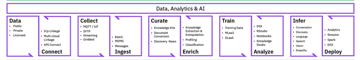
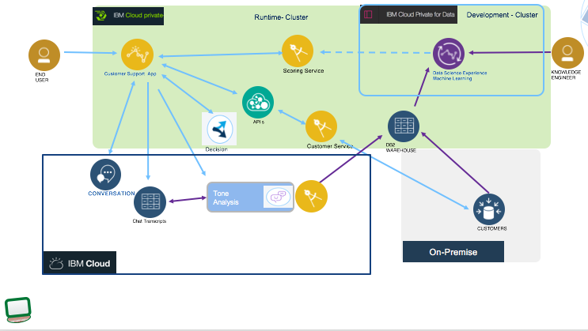
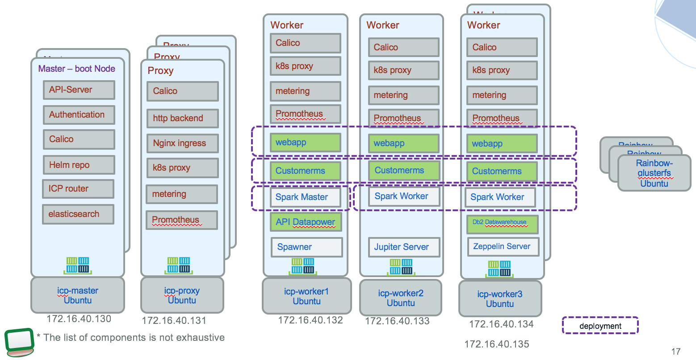
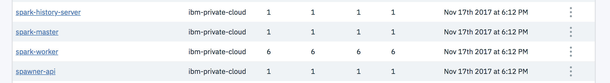
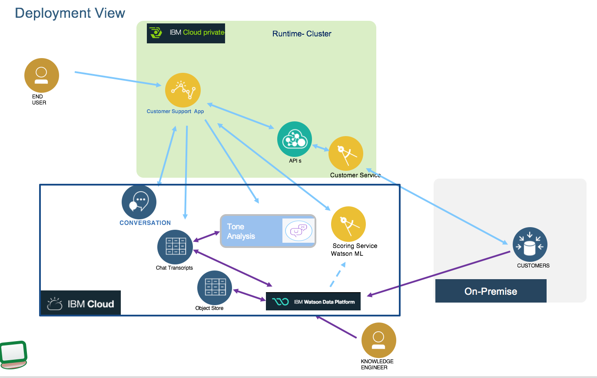
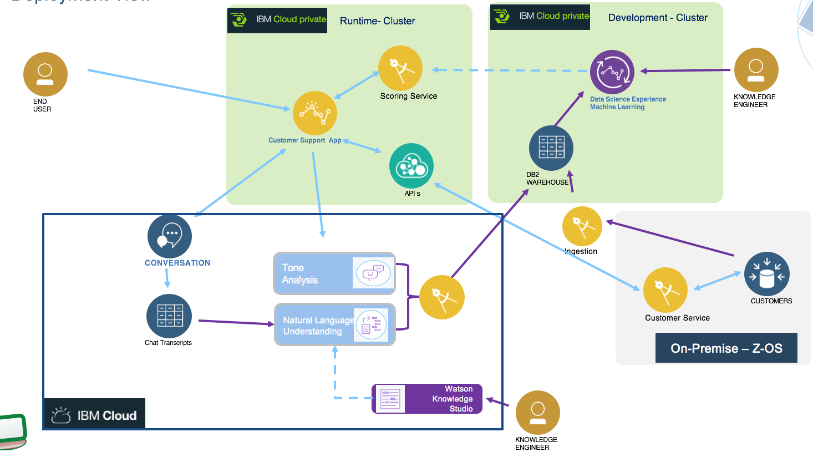

# Customer analysis with cognitive and analytics in hybrid cloud
The goal of this implementation is to deliver a reference implementation for data management and service integration to consume structured and unstructured data to assess customer attrition.
Modern applications are leveraging a set of capabilities to do a better assessment of customer characteristics and deliver best actions or recommendations. The technologies involved, include artificial intelligence, data governance, ingestion, enrichment, storage, analysis, machine learning, unstructured data classifications, natural language understanding, tone analysis, and hybrid integration....

Update 02/09/18 (happy birthday Mamee): The solution is not a lab or complete end to end tutorial...yet...

## Target audience
* IT Architects who want to understand the components involved and the architecture constraints and design considerations
* Developers who want to get starting code, and educate themselves on the related technologies
* Data Scientists who want to complement machine learning with cognitive output like classification  

## Key points
* Data scientists need different source of data, structured from traditional SQL based database (e.g. the customers and accounts data) and unstructured output of new cognitive services.
* Data Scientists work hand by hand with application developers to quickly deliver solution to the business
* Data access layer to traditional relational data should be done with a micro service approach exposing RESTful API or using modern z OS Connect application.
* Cloud native apps, micro services, can be deployed in public or private cloud, like IBM Cloud private based on Kubernetes and containers
* Public services like the Watson services can be easily integrated within the solution: Watson Data Platform, Data Science Experience, Tone Analyzer, Watson Conversation
* API management is used to present a unique API for customer data, standardize for consumers like the webapp, even if the back end is Java based or z Connected based.

## Table of contents
* [Presentation](#presentation)
* [Components](#components)
* [Run](./docs/run.md)
* [Methodology](#methodology)
* [Deployment](#deployment)
* [Implementation detail](./docs/code.md)
* [Resiliency](#resiliency)
* [Further readings](#further-readings)

## Presentation
### An unhappy customer
Eddie is an existing Green Telco Inc customer living in Orlando Fl.  He has been using the services provided by the Green Telco for the last 2 years. Currently, he is not under any contract.  Eddie signed for a new phone which was "buy one get one" free bundle. He bought one of the phone with cash and he put the other phone on a monthly plan. For Eddie to get the second phone free he has to submit the receipt to the Green Telco to get an equivalent value of the phone as a credit card. Eddie was traveling to conferences in Madrid and in Bangkok so he also signed up for international text and data service.  

So he owns two phones:  
* Sam Milky Way Phone 1   $750   paid in full with cash
* Sam Milky Way Phone 2   $750   on a monthly plan of $30

Upon submission of receipt the Green Telco company sends a Credit Card of $750. Eddie can use the Credit card to pay the balance of $750 for phone 2. Further, Eddie signed for free international text and data for a fee of $10 a month when he is traveling overseas to Madrid and, Bangkok.

After Eddie submitted the receipt to the Green Telco provider, Eddie went to Madrid and then to Bangkok.

While in Bangkok the data plan and the text plan was very slow and did not perform to the level that the sales person at the Green Telco had suggested Eddie that it will work.  By paying $10 per month extra Eddie was told that he will get double the speed. In reality the original speed was very less and even after double the speed, the speed was very less. So, Eddie was not very happy with the service. Eddie, felt that the sales person did not reveal all the information.

To add insult to injury when Eddie came back to check on his status for the free phone (he had not received any notification from the Green Telco). So, Eddie contacts the Telecom provider support via a chat bot on the web application.

The telecom provider informs Eddie that his claim was rejected and that he does not qualify for the $750 phone.

Eddie, who was already not happy with the International Data and Text service he had signed-up for and now he was not getting his refund.

The chat bot then checks the customer churn scoring service and finds out that the customer churn predicts a churn with a very high level of confidence and immediately notifies Eddie that a supervisor will contact Eddie to resolve the issue.

The supervisor contacts Eddie immediately. He apologizes to Eddie that the speed to begin with is very low and even by adding $10 the double speed does not make much of a difference. This service is mostly designed for texting and browsing emails and some important work and not designed for the kind of quality of service that Eddie is used to in the US.

Further the supervisor explains to Eddie that the reason he was not given the $750 is because both the phones have to be on contract payment. Since one of the phone was a cash payment the promotion does not apply. The supervisor acknowledged that to fix the problem, she had called the store and if Eddie goes to the store the previous transaction will be reversed and both the phone would be put on contract and his $750 payment will be expedited.

Eddie walks in the store and his problem was resolved. Once, he got the refund in one week he paid the first phone with his cash and the second phone with the $750 visa card.

The customer churn service helped Eddie to remain as a customer for the Green Telco.

### System Context diagram
The following diagram illustrates the system context of the application, including analytics model preparation and run time execution.

This repository presents best practices to deploy such solution on public and private cloud, implements the webapp deployable in public or private cloud, and deliver example of data sets.

## Components
From above figure left to right the components involved are:
1. **Web application** to offer a set of services for the end user to use: from this user interface the end user, customer of Green Telco, can access his account, pays his bill and uses the chat bot user interface to get support help. [This note](docs/code.md) presents the implementation details and how to deploy it on ICP.
1. The current chat application is not using any automated bot, but it is a messaging application with human as actors. There is no implementation for this component.
1. The conversation transcripts are persisted in a document oriented database. We discuss about its implementation with Cloudant in [this technical note.](docs/persist/chattranscripts.md)
1. The chat bot is implemented with **Watson Conversation**. The workspace is delivered for you to upload to a Watson cloud service you may have created, [this note](docs/wcs/README.md) go into the implementation detail and deployment.
1. A **scoring service** to assess current risk of churn for the customer interacting with Green Telco services. This is a runtime analytics service using customer data and results from the Tone Analysis. [This note](docs/scoring-serv.md) goes over the detail of the deployment and implementation of this machine learning based service.
1. The conversation sentence can be analyzed for **tone analysis**, and natural language understanding, those data are used by the scoring service. The service creation in IBM Cloud and the integration into the application flow is explained in [this note](./docs/w-tone-analyzer.md)
1. The customer [data](https://github.com/ibm-cloud-architecture/refarch-integration-services#data-model) are persisted in on-premise server with relational database. We are using DB2 on-premise server for that. To read how the database was created see [the note in this repository](https://github.com/ibm-cloud-architecture/refarch-integration-services/blob/master/docs/DB2Creation.md)
1. Customer data are exposed via a **micro service** approach. The implementation is done in a separate repository: [the Customer management micro-services](https://github.com/ibm-cloud-architecture/refarch-integration-services). It supports the JAXRS implementation deployed in Liberty as Docker image and the DB2 schema for DB2 data base.
1. **API product** can be defined on top of the customer management service to monitor API usage and perform API governance. The implementation is supported by IBM API Connect. Some explanation of the product development in [this note](./docs/apim/README.md)
1. Data scientists use machine learning library and Jupiter notebook, R Studio or Zeppelin on top of Apache Spark in IBM Data Science Experience (DSX) to discover the model. We are documenting two different approaches:
   * One based on Watson Data Platform running on IBM Cloud and described in [This note](./docs/ml/README.md) with [a jupyter notebook](./docs/ml/CustomerChurnAnalysisCI-bpull.md).
   * One based on [Private cloud using DSX and Db2 warehouse](docs/ml/icp-dsx-ml-model.md).

1. The data used by data scientists are persisted in Db2 warehouse. [This note](https://github.com/ibm-cloud-architecture/refarch-analytics/tree/master/docs/db2warehouse) goes over the creation of the Db2 warehouse release within IBM Cloud private.
1. **Ingestion** mechanism can move data, for chat transcripts and customer records to the DB2 warehouse. This process can run on demand when Data Scientists need new data to tune the model. It can be implemented with an ETL, with Java program, or using the Db2 Federation capability. [This note](docs/data/README.md) explains what was done to move DB2 customer data to Db2 warehouse.
1. The natural language understanding service is added to support most advanced language processing from the text entered but the end user: entity extraction, relationships, taxonomy, etc. Those elements could be used for scoring services. The language understanding can be fine tuned by using terms and model defined in **Watson Knowledge Studio**.

### Demonstration Script
As an executable solution, we are presenting the demonstration script in a [separate note.](docs/flow/README.md). You need to have a running environment or being able to access our IBM internal environment for that.

## Methodology
The following diagram illustrates the artificial intelligence / cognitive capabilities developers can integrate in their business application. data scientists can leverage to develop their analytics models, and the data tasks that need to be perform on private, public or licensed dataset.

### Micro service development
From a pure software engineering implementation, we adopt agile, iterative implementation: the following lower level tasks were done:
* Develop the data model for the customer, accounts, device as java classes...
* Develop the Java REST API with resources for customer, account and products, and JAXRS annotations
* Unit test the API
* Add JPA annotation to entities, develop Data Transfer Object for service interface, refactoring the API.
* Implement Data Access Object classes with respective unit tests. In fact we started by defining the tests. We used a embedded derby, which has a very similar SQL support as DB2, for the unit tests.
* Develop compile and build script using gradle to be ready for CI/CD
* Package the webapp as war, deploy to a liberty, tune the liberty settings
* Dockerize the service with liberty server and the webapp  
* Build helm chart to deploy to IBM Cloud private
* Build DB2 scripts to prepare the external database, create instance to test and product DB2 instances, add simple data for testing and demo
* Develop integration tests to validate at the API level the end to end senario
* Develop the WebApp to support the demonstration using nodejs and angular 4 and the BFF pattern
* Integrate the webApp with the customer manager micro service running on icp
* Define / extract the swagger using Liberty api Discovery which is able to introspect the JAXRS annotations and generates the swagger
* Share the swagger with Z OS team so they can implement the service with z Connect bases on the same interface definition
* Add API product using the swagger, publish the API to the Data Power gateway, test with Postman the integration API -> REST service on ICP -> DB2 on on-premise server.
* Change the URL of the webapp to point to the API end point, redeploy to ICP.

### Analytics specifics
TO BE COMPLETED.

## Deployment
There are multiple possible configurations for the deployment, depending of the use of public and private cloud and the legacy system involved. For the back end we have two options: Z OS with DB2 and Z Connect, and Java based REST micro service and DB2.

For the machine learning, two options too, 1- DSX on ICP with Spark cluster for model execution or 2- Watson Data Platform on IBM Cloud with Watson ML on IBM Cloud for the scoring service.

### Using data service as a Java micro service:
The first configuration deploys the `customer manager` micro service on IBM Cloud Private, accessing customer and account tables deployed on DB2 servers out side of ICP. API Connect is used to manage customer API product. The Web application, the customer service, and the churn risk scoring are deployed on ICP.

* As machine learning discovery tasks running on Spark cluster are development activities and consume a lot of resources we propose to separate the DSX, Db2 warehouse and Spark cluster in its separate ICP instance. The decision to use separate cluster is really linked to the size of the dataset to process, and the execution frequency: with dedicated team of Data Scientist, with terrabyte of data.
* The runtime for cloud native applications and micro services is an ICP with HA and DR support.
* The scoring service is deployed on a Spark Cluster running on ICP runtime cluster.
* The DB2 instance runs on separate on-premise servers, to illustrate the use case of keeping existing infrastructure investments.
* Watson Cognitive services are on IBM Cloud, public offering,
* The datasource to persist the conversation data is Cloudant DB on Public Cloud.

### The ICP run time clustering
The cluster topology with some of the major ICP and solution components will look like the following diagram:

The dashed lines highlight the deployment concept of k8s. The Db2 warehouse is using external `Glusterfs` cluster for persisting data via the persistent volumes and persistent volume claim.

The spark cluster, master, spawner... are deployments inside ICP and installed via DSX Local.  

### Using Watson Data Platform
As an alternate to use DSX on ICP to develop the machine learning model, Data Scientist can use Watson Data platform to gather the data from multiple datasources like Amazon S3, CloudantDB, and from transactional data, persist in public object store and deploy the model once trained to Watson Machine learning.

See [this note](docs/ml/README.md) for detail about the implementation of the analytic model, and the see the `WMLChurnServiceClient.js` code for the integration part.

### Using Data Service as Z Connect service
For Z OS deployment the solution looks like the diagram below, where the data service and DB2 are running on Z OS.

[This note](docs/Z/README.md) details the Z Connect implementation.

# Further readings
* [Data Analysis using Spark on zOS and Jupyter Notebooks](https://github.com/IBM/Spark-on-zOS)
* [DSX](https://datascience.ibm.com/)

# Contribute
We welcome your contribution. There are multiple ways to contribute: report bugs and improvement suggestion, improve documentation and contribute code.
We really value contributions and to maximize the impact of code contributions we request that any contributions follow these guidelines
* Please ensure you follow the coding standard and code formatting used throughout the existing code base
* All new features must be accompanied by associated tests
* Make sure all tests pass locally before submitting a pull request
* New pull requests should be created against the integration branch of the repository. This ensures new code is included in full stack integration tests before being merged into the master branch.
* One feature / bug fix / documentation update per pull request
* Include tests with every feature enhancement, improve tests with every bug fix
* One commit per pull request (squash your commits)
* Always pull the latest changes from upstream and rebase before creating pull request.

If you want to contribute, start by using git fork on this repository and then clone your own repository to your local workstation for development purpose. Add the up-stream repository to keep synchronized with the master.
This project is still under active development, so you might run into [issues](https://github.com/ibm-cloud-architecture/refarch-cognitive-analytics/issues)
Please [contact me](boyerje@us.ibm.com) for any questions.
