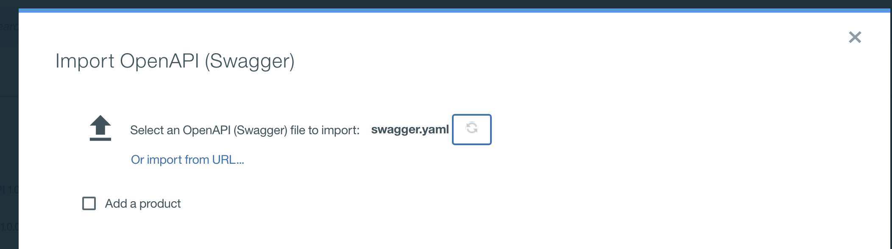
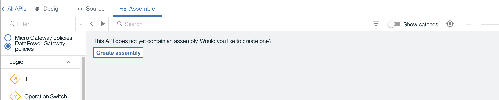

# Defining customer API product
We are detailing how the `customer API` product was developed to integrate with the REST api back end. This is not a tutorial, this is more for education purpose.

## Pre-requisite
You need to have access to IBM API Connect management product. We have one instance within our on-premise server, soon we will use one on ICP. You need to access the swagger file from the [service project](https://github.com/ibm-cloud-architecture/refarch-integration-services/blob/master/src/main/webapp/META-INF/stub/swagger.yaml).

## Development steps done
### Step 1: Create product from swagger
Connect to the API manager, our url is 172.16.40.88/apim. From the main page click `Add` and select `Import API from file`

.

Select the swagger `src/main/webapp/META-INF/stub/swagger.yaml` from the integation-service project:

this should create a project customer-management-micro-service-api. The Paths section of the definition includes the CRUD operation on the customers resource:

You do not need to use all the operation of the imported swagger, and it is possible to delete operations that we do not want to expose to external client applications.

Instead of using an already defined swagger you can develop the API definition manually in the API Designer tool and the following product documentation gives you some how to do it. https://www.ibm.com/support/knowledgecenter/en/SSMNED_5.0.0/com.ibm.apic.toolkit.doc/task_APIonPrem_createapi.html

## Step 2: Define operation mapping
For each operation define the mapping to the back end operation. So go to the `Assembly editor`, and create a new assembly

Then drag and drop the Operation logic operator:

Add some case to represent the operations you want to add. We start by the three read only operations we need for the user interface to call: get all customer, get a customer given its id, and giving its email.

API management is using its own vocabulary for such implementation:
* *Policies* are the building blocks of assembly flows, and they provide the means to configure capability, such as security, logging, routing of requests to target services, and transformation of data from one format to another.
*  Logic constructs behave in a similar way to policies, but they affect how and which parts of the assembly are implemented without modifying the data flow of the assembly.

The following diagram illustrates an `Invoke` policy to call the back end:

## Step 3: unit test

## Step 4: define and deploy product
Some important concepts to keep in mind: products provide a method by which you can group APIs into a package that is intended for a particular use or channel. Products contain Plans, which can be used to differentiate between different offerings.

To make an API available to an application developer, it **must be** included in a Plan. Products are then published in a Catalog.

A lifecycle manager can then control the availability and visibility of APIs and Plans through the API Manager. The application developer can only subscribe to one Plan from a specific Product.

It is possible to create a default product directly from the APIs:

