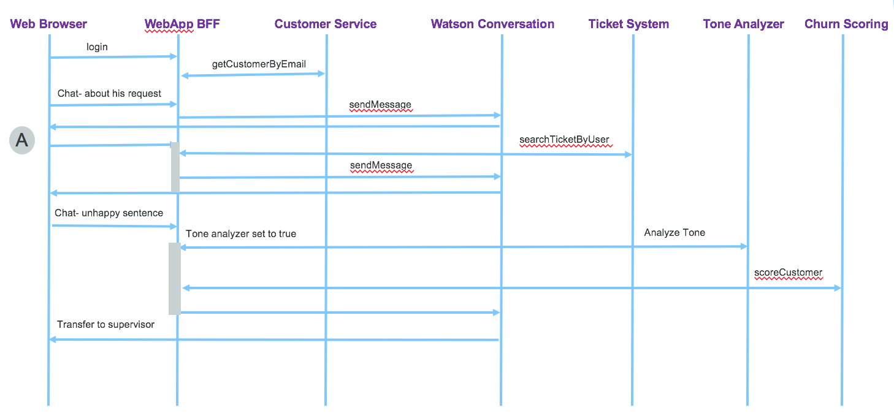
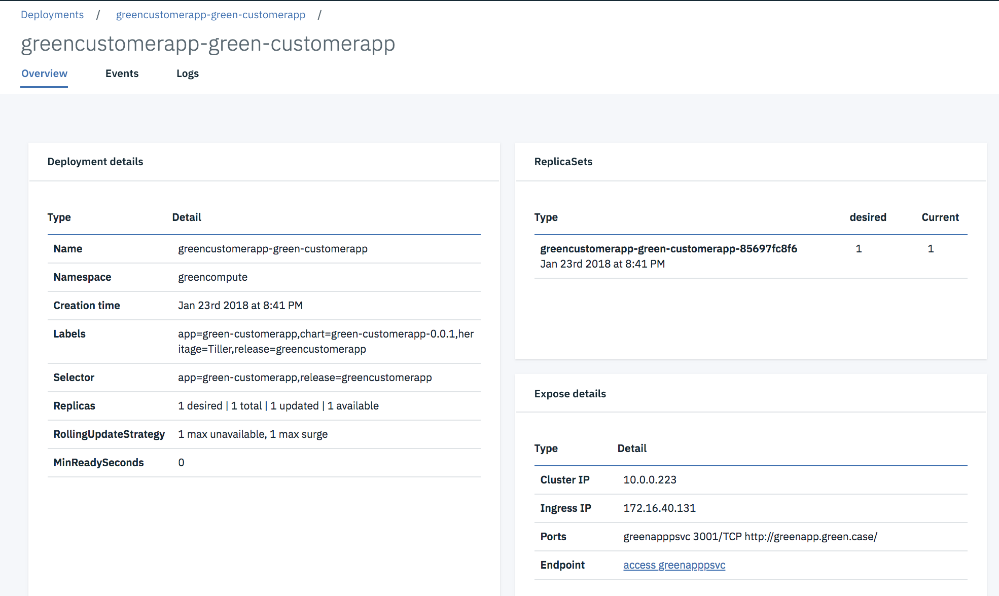

# Implementation explanations
## Web Application
### Code explanation
Most of the interactions the end users are doing via the Web Browser are supported by [Angular 4 single page](http://angular.io) javascript library, with its `router` mechanism and the DOM rendering capabilities via directives and components. When there is a need to access data to the on-premise server for persistence, an AJAX call is done to server, and  the server will respond asynchronously later on. The components involved are presented in the figure below in a generic way


From an implementation point of view we are interested by the router, the controller and the services.

To clearly separate the codebase for front-end and back-end the `src/client` folder includes angular 4 code while `src/server` folder includes the REST api implemented with expressjs.

## Angular app
The application code follows the standard best practices for Angularjs development:
* unique index.html to support single page application
* use of modules to organize features
* use of component, html and css per feature page
* encapsulate calls to back end for front end server via service components.

We recommend beginners one Angular to follow the [product "tour of heroes" tutorial here.](https://angular.io/tutorial)

### Main Components
As traditional Angular 4 app, you need:
*  a `main.ts` script to declare and boostrap your application.
* a `app.module.ts` to declare all the components of the application and the URL routes declaration. Those routes are internal to the web browser. They are protected by a guard mechanism to avoid unlogged person to access the page. The following code declares 3 routes for the three main features of this application: display the main top navigation page, the customer page to access account, and the itSupport to access the chat bot user interface. The AuthGard assess if the user is known and logged, if not it is routed to the login page.
 ```
 const routes: Routes = [
   { path: 'home', component: HomeComponent,canActivate: [AuthGuard]},
   { path: 'log', component: LoginComponent },
   //canActivate: [AuthGuard]
   { path: 'itSupport', component: ConversationComponent,canActivate: [AuthGuard]},
   { path: 'customer', component: CustomersComponent,canActivate: [AuthGuard]},
   // otherwise redirect to home
   { path: '**', redirectTo: 'home' }
 ]
 ```
* an `app.component` to support the main page template where routing is done. This component has the header and footer of the HTML page and the placeholder directly to support sub page routing:
 ```
    <router-outlet></router-outlet>
 ```

### Home page
The home page is just a front end to navigate to the different features. It persists the user information in a local storage and uses the Angular router capability to map widget button action to method and route.
For example the following HTML page uses angular construct to link the button to the `itSupport()` method of the Home.component.ts
```html
<div class="col-md-6 roundRect" style="box-shadow: 3px 3px 1px #05870b; border-color: #05870b;">
      <h2>Support Help</h2>
      <p>Get help</p>
      <p><button (click)="itSupport()" class="btn btn-primary">Ask me</button></p>
</div>
```

the method delegates to the routing based on url
```javascript
itSupport(){
  this.router.navigate(['itSupport']);
}
```
### Conversation bot
For the conversation front end we are re-using the code approach of the conversation broker of the [Cognitive reference architecture implementation](https://github.com/ibm-cloud-architecture/refarch-cognitive-conversation-broker)
The same approach, service and component are used to control the user interface and to call the back end. The service does an HTTP POST of the newly entered message. The server code is under `server/routes/features/conversation.js`


### Account component
When the user selects to access the account information, the routing is going to the account component in `client/app/account` folder use a service to call the nodejs / expressjs REST services as illustrated in the code below:  

```javascript
export class CustomerService {
  private invUrl ='/api/c';

  constructor(private http: Http) {
  };

  getItems(): Observable<any>{
    return this.http.get(this.invUrl+'/customer')
         .map((res:Response) => res.json())
  }
}
```
The http component is injected at service creation, and the promise returned object is map so the response can be processed as json document.

An example of code using those service is the `account.component.ts`, which loads the account during component initialization phase.

```javascript
export class AccountComponent implements OnInit {

  constructor(private router: Router, private cService : CustomerService){
  }

  // Uses in init to load data and not the constructor.
  ngOnInit(): void {
    this.user = JSON.parse(localStorage.getItem('currentUser'));
    if(this.user && 'email' in this.user) {
      cService.getCustomerByEmail(this.user.email).subscribe(
          data => {
            this.customer=data;
          },
          error => {
            console.log(error);
          });
    }
  }
}
```


## Server code
The application is using nodejs and expressjs standard code structure. The code is under `server` folder.
### Conversation back end.
The script is in `server/route/features\chatBot.js` and uses the Watson developer cloud library to connect to the remote service. This library encapsulates HTTP calls and simplify the interaction with the public service. The only thing that needs to be done for each chat bot is to add the logic to process the response, for example to get data from a backend, presents user choices in a form of buttons, or call remote service like a rule engine / decision service.

This module exports one function to be called by the API used by the front end. This API is defined in `api.js` as:
```javascript
app.post('/api/c/conversation',isLoggedIn,(req,res) => {
  chatBot.chat(config,req,res)
});
```

The `chatBot.chat()` method gets the message and connection parameter and uses the Watson API to transfer the call.

```javascript
chat : function(config,req,res){
  req.body.context.predefinedResponses="";
  console.log("text "+req.body.text+".")
  if (req.body.context.toneAnalyzer && req.body.text !== "" ) {
      analyzeTone(config,req,res)
  }
  if (req.body.context.action === "search" && req.body.context.item ==="UserRequests") {
      getSupportTicket(config,req,res);
  }
  if (req.body.context.action === "recommend") {
      // TODO call ODM Here
      sendToWCSAndBackToUser(config,req,res);
  }
  if (req.body.context.action === "transfer") {
      console.log("Transfer to "+ req.body.context.item)
  }

  if (req.body.context.action === undefined) {
      sendToWCSAndBackToUser(config,req,res);
  }
} // chat
```


The send message uses the Watson developer library:
```javascript

  conversation = watson.conversation({
          username: config.conversation.username,
          password: config.conversation.password,
          version: config.conversation.version,
          version_date: config.conversation.versionDate});

  conversation.message(
      {
      workspace_id: wkid,
      input: {'text': message.text},
      context: message.context
      },
      function(err, response) {
        // add logic here to process the conversation response
      }
    )
```
It uses content of the conversation context to drive some of the routing mechanism. This code supports the following sequencing:



* As the user is enquiring about an existing ticket support, the conversation set the action variable to "search", and return a message in "A" that the system is searching for existing records. The web interface send back an empty message on behave of the user so the flow can continue.

* If the conversation context has a variable action set to "search", it calls the corresponding backend to get other data. Like a ticket management app. We did not implement the ticket management app, but just a mockup.
```javascript
if (req.body.context.action === "search" && req.body.context.item ==="UserRequests") {
  ticketing.getUserTicket(config,req.body.user.email,function(ticket){
      if (config.debug) {
          console.log('Ticket response: ' + JSON.stringify(ticket));
      }
      req.body.context["Ticket"]=ticket
      sendToWCSAndBackToUser(config,req,res);
  })}
```
The ticket information is returned to the conversation directly and the message response is built there.
* if the action is "recommend", the code can call a decision service deployed on IBM Cloud and execute business rules to compute the best recommendations/ actions. See example of such approach in [the project "ODM and Watson conversation"](https://github.com/ibm-cloud-architecture/refarch-cognitive-prod-recommendations)
* If in the conversation context the boolean `toneAnalyzer` is set to true, then any new sentence sent by the end user will be sent to Watson Tone Analyzer.
```javascript
if (req.body.context.toneAnalyzer && req.body.text !== "" ) {
    analyzeTone(config,req,res)
}
```
* When the result to the tone analyzer returns a tone as `Sad or Frustrated` then a call to a churn scoring service is performed.
```javascript
function analyzeTone(config,req,res){
  toneAnalyzer.analyzeSentence(config,req.body.text).then(function(toneArep) {
        if (config.debug) {console.log('Tone Analyzer '+ JSON.stringify(toneArep));}
        req.body.context["ToneAnalysisResponse"]=toneArep.utterances_tone[0].tones[0];
        if (req.body.context["ToneAnalysisResponse"].tone_name === "Frustrated") {
          churnScoring.scoreCustomer(config,req,function(score){
                    req.body.context["ChurnScore"]=score;
                    sendToWCSAndBackToUser(config,req,res);
              })
        }
  }).catch(function(error){
      console.error(error);
      res.status(500).send({'msg':error.Error});
    });
} // analyzeTone
```

* when the churn score is greater than a value the call is routed to a human. This is done in the conversation dialog and the context action is set to Transfer
```javascript
if (req.body.context.action === "transfer") {
  console.log("Transfer to "+ req.body.context.item)
}
```
See also how the IBM Watson conversation is built to support this logic, in [this note.](wcs/README.md)

Finally this code can persist the conversation to a remote document oriented database. The code is in `persist.js` and a complete detailed explanation to setup this service is in [this note.](persist/chattranscripts.md)

### Customer back end
The customer API is defined in the server/routes/feature folder and uses the request and hystrix libraries to perform the call to the customer micro service API. The `config.json` file specifies the end point URL.

The Hystrixjs is interesting to use to protect the remote call with timeout, circuit breaker, fails quickly.... modern pattern to support resiliency and fault tolerance.

```javascript
var run = function(config,email){
  return new Promise(function(resolve, reject){
      var opts = buildOptions('GET','/customers/email/'+email,config);
      opts.headers['Content-Type']='multipart/form-data';
      request(opts,function (error, response, body) {
        if (error) {reject(error)}
        resolve(body);
      });
  });
}

// times out calls that take longer, than the configured threshold.
var serviceCommand =CommandsFactory.getOrCreate("getCustomerDetail")
  .run(run)
  .timeout(5000)
  .requestVolumeRejectionThreshold(2)
  .build();

getCustomerDetail : function(config,email) {
    return serviceCommand.execute(config,email);
}

```

### Churn risk Scoring
The scoring is done by deploying a trained model as a service. We have two clients, one for Watson Data Platform and one for Spark cluster on ICP.
The interface is the same so it is easy to change implementation.

### ICP deployment
For this web application we are following the same steps introduced within the [Brown Case Web app application](https://github.com/ibm-cloud-architecture/refarch-caseinc-app/blob/master/docs/icp/README.md) and can be summarized as:
* Compile the app: `ng build`
* Create docker images: `docker build -t ibmcase/greenapp . `
* Tag the image with the docker repository name, version: `docker tag ibmcase/greenapp greencluster.icp:8500/greencompute/greenapp:v0.0.2`
* Push the docker images to the docker repository running on the Master node of ICP:
```
$ docker login greencluster.icp:8500
$ docker push greencluster.icp:8500/greencompute/greenapp:v0.0.2
```
* Be sure the parameter of the config object in the `values.yaml` for the kubernetes deployment use the values of the environment.
```yaml
config:
  conversation:
    version: v1
    versionDate: 2017-05-26
    username: 291d9
    password: ss
    conversationId: Complex Relocation
    workspace: a92
    usePersistence: false
  customerAPI:
    url: https://172.16.50.8:443/csplab/sb
    host: greencustomerms-green-customerms
    xibmclientid: <>
  toneAnalyzer:
    url: https://gateway.watsonplatform.net/tone-analyzer/api
    versionDate: 2017-09-21
    username: <>
    password: <>
  dbCredentials:
    url: https://<>
```
In the settings above the URL for the customer API is going to the API gateway.

* Change the virtual hostname if you want to. The current name is `greenapp.green.case`, and if you have existing Ingress rule that defines the same hostname, you need to take care of that.
* Be sure to be connected to the kubernete server with commands like:
```
kubectl config set-cluster greencluster.icp --server=https://172.16.40.130:8001 --insecure-skip-tls-verify=true
kubectl config set-context greencluster.icp-context --cluster=greencluster.icp
kubectl config set-credentials admin --token=<>
kubectl config set-context greencluster.icp-context --user=admin --namespace=browncompute
kubectl config use-context greencluster.icp-context

```
* Install the Helm release with the greencompute namespace: `helm install green-customerapp --name green-customerapp --namespace greencompute`



* Be sure you have name resolution from the hostname you set in values.yaml and IP address of the ICP proxy. Use your local '/etc/hosts' file for that. In production, set your local DNS with this name resolution.

* Test by accessing the URL: `http://http://greenapp.green.case/`


## Customer Microservice
The back end customer management function is a micro service in its separate repository, and the code implementation explanation can be read [here.](https://github.com/ibm-cloud-architecture/refarch-integration-services#code-explanation)

# More readings
* [Angular io](https://angular.io/)
* [Hystrixjs the latency an fault tolerance library](https://www.npmjs.com/package/hystrixjs)
* Javascript Promise chaining [article](https://javascript.info/promise-chaining)
