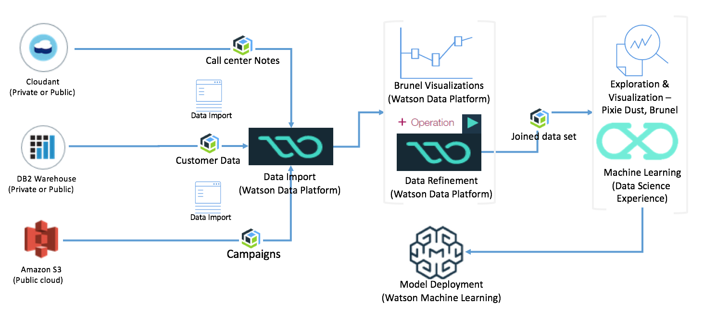
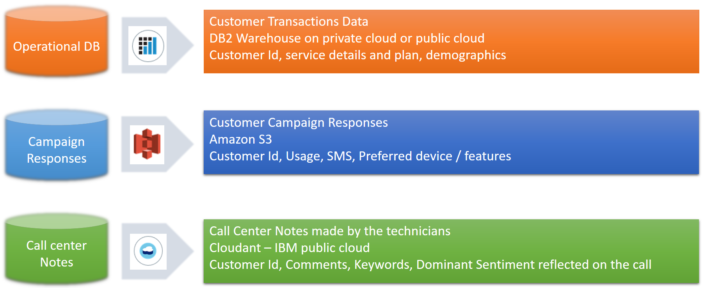

# Customer Churn Analytics using IBM Data Science Experience and Watson Data Platform

## Introduction and Background

This section outlines the steps to build and deploy an analytical model for predicting customer churn, using the combination of tooling in Watson Data Platform (WDP), and IBM Data Science Experience (DSX). The steps involve gathering data from various sources, aggregating them using Jupyter notebooks, building and training an analytical model, and finally deploying it on Watson Data Platform.

The overall system context for this part of the solution is outlined in the following picture.

For the purposes of this exercise, this section shows similar operations (like filling missing values in the dataset) both in WDP and DSX. The reason is to illustrate the capabilities and the art of the possible.

The solution involves three datasets from the analytics standpoint, as outlined below:

1. **Customer Transaction Data**: This data contains the customer's personal information and demographics (age, marital status, income etc.), and the subscription related details (such as phone model, plans, bill type etc.). This information is stored in a DB2 Warehouse database on cloud.
2. **Customer campaign results**: This dataset includes the results of a marketing campaign conducted by a third part marketing firm for the Telco customers. This is intended to capture the customer's preferred device or feature (such as large display, Android phone etc.) and usage related aspects such as if the customer has multiple phone numbers, and the number of SMS text messages the customer exchanges with his contacts. The notion is, the usage model and preferences, could have a strong influence in any given customer's preference to stay with the provider or leave. As per the scenario in this solution, this data is stored in the data servers of the marketing firm, which is on a third party cloud. The marketing firm makes this dataset available on Amazon S3.
3. **Call center notes**: This dataset contains a short, summary style description of customer's complaint, two or three important keywords showing the device, feature, and the problem, and the sentiment shown by the customer. In some cases customers simply ask questions such as where the nearest store is. These kinds of entries may have no value for sentiments. These need to be fixed before one can perform analytics. This dataset resides in Cloudant on IBM cloud. Since each customer complaint is a service ticket, which essentially is a document, this data is stored in Cloudant.

The steps will be mostly aligned with CRISP-DM methodology, but with the main focus on the data preparation and analytics.

## Prerequisites

Before beginning the exercise, make sure you have accounts in the following systems.

1. [IBM Cloud](http://www.bluemix.net)
2. [Watson Data Platform](http://dataplatform.ibm.com)
3. [IBM Datascience Experience](http://datascience.ibm.com) - If you register for access in Watson Data Platform, you will get access to IBM datascience experience. As an alternate use the DSX on IBM Cloud Private  instance.

The datasets used in this exercise are shown in the data subfolder of this github repository. It is assumed you know how to create instances of services on IBM Cloud (Cloudant, DB2 Warehouse), and Amazon S3. Those steps are not outlined in the following sections, and for guidance with those services, the user is advised to check the documentation.

Chrome and Firefox are tested for this exercise and for the examples shown here. Other browsers may or may not work. It is left to the user to check and make sure.

## Data Ingestion & Data Preparation

Ingestion of data from different data sources requires creating connection to the data sources, and importing the datasets. Preparation of data involves operations inside Data Refinery using the shaper tool. Part of the data preparations are also shown inside DSX.

To begin with, open IBM Watson Data Platform (henceforth in this document referred to as WDP) using a browser. The main screen should show something like the following:

## Analytical Model

## Appendix 1: Data Catalogs

## Appendix 2: Performance Monitoring & Fine Tuning

## Appendix 3: Secure Service Gateway to go from public cloud to private cloud
