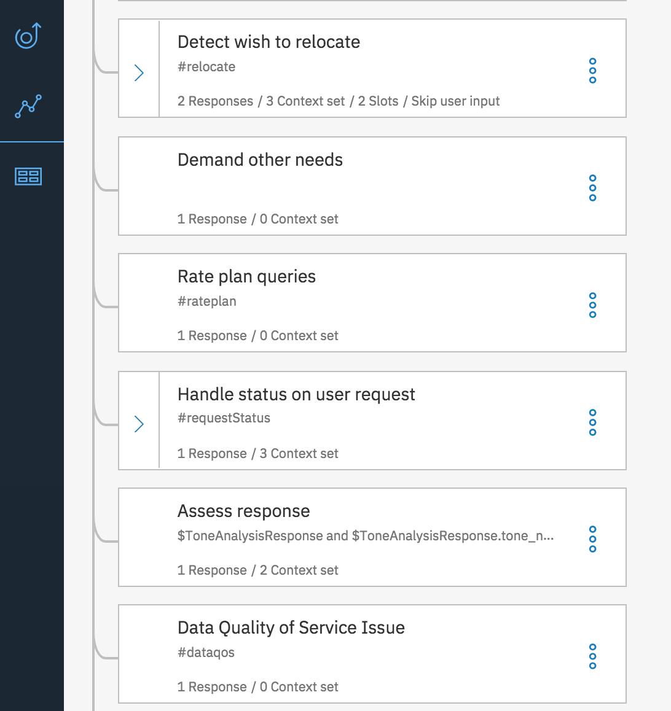
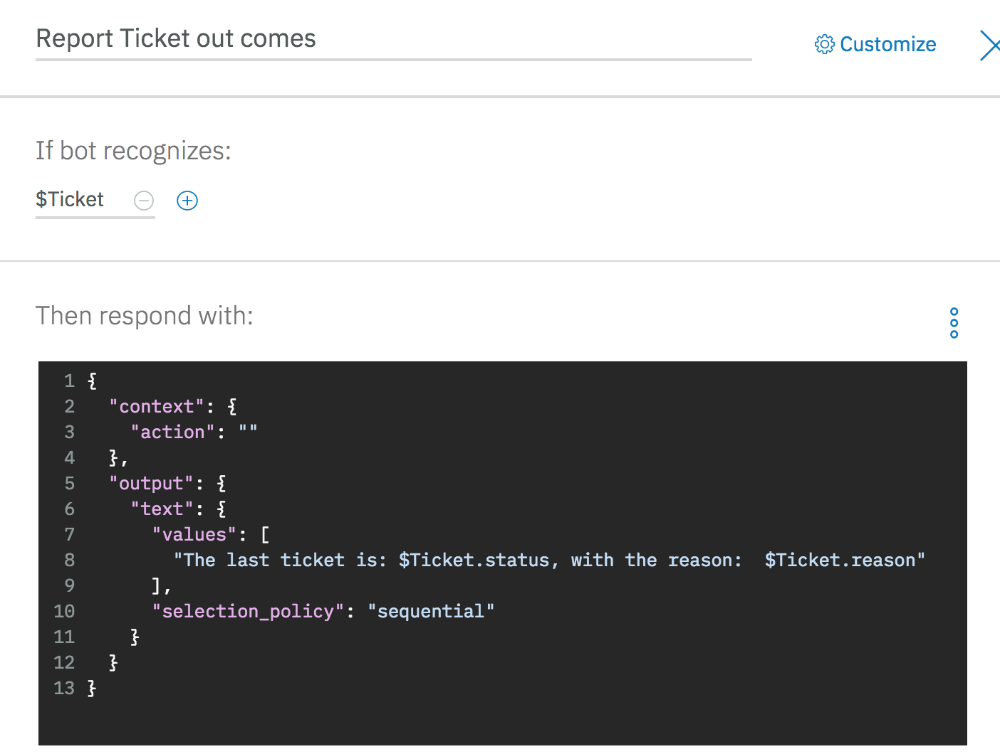
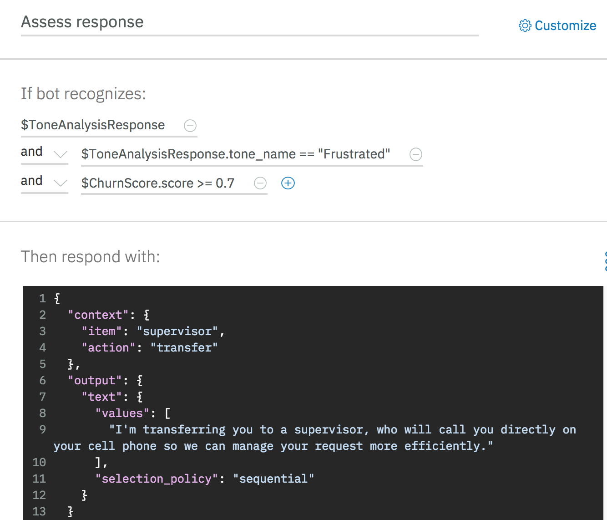

# Support Chat bot with Watson Conversation
We recommend to follow [this tutorial](https://www.ibm.com/cloud/garage/tutorials/watson_conversation_support) to learn how to develop a Watson Conversation service and dialog flow.
The implemented Watson Conversation workspace is under the folder `src/wcs`, named `telco-support-wcs-wks.json`. You can import it into your conversation service:

## What we built:
For this project, looking at the [use case](https://github.com/ibm-cloud-architecture/refarch-cognitive-analytics#use-case) description, and the type of interactions expected by end user like Eddie, we implemented the following intents:
* *Request status* to address when a user is asking from an existing rebate request, or support request.

* Create the intent about *network data quality*.  

The we work on the dialog flow to define how to respond to intent. We need to have one node per intent:
* Add one to support the *rate plan request* intent, one for assess the status of an existing ticket, one for data quality...

* Handle the ticket request by setting the context variables action and item. Also as conversation about a ticket status may be emotional we trigger the call to ToneAnalyzer by setting a new context variable:

* When the system returns the ticket information, the code could have returned the answer directly, but it is good to come back to the dialog flow to manage where to be and use the context variables to control the response:

* Finally when the tone analyzer returns values is risky the code calls the churn scoring service, adds it to the conversation context, and now the dialog can prepare an adequate response, like transfering to a human.

Recall that you can unit test the conversation inside the Editor. See the tutorial on how to do so.
