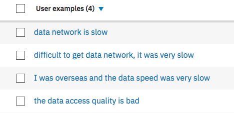

# Support Chat bot with Watson Conversation
We recommend to follow [this tutorial](https://www.ibm.com/cloud/garage/tutorials/watson_conversation_support) to learn how to develop a Watson Conversation service and dialog flow.

For this project, looking at the use case description, and the type of interactions expected by end user like Eddie, we implemented the following intents:
* Request status to address when a user is asking from an existing rebate request, or support request.

* Create the intent about network data quality.  

* Add dialog flow to support each intents: We need to have one node per intent: one for rate plan request, assess the status of an existing ticket

* Handle the ticket request by setting the context variables action and item. Also as conversation about a ticket status may be emotional we trigger the call to ToneAnalyzer by setting a new context variable:

* When the system returns the ticket information, the code could have returned the answer directly, but it is good to come back to the dialog flow to manage where to be and use the context variables to control the response:

* Finally when the tone analyzer returns values is risky the code calls the churn scoring service, adds it to the conversation context, and now the dialog can prepare an adequate response, like transfering to a human.

